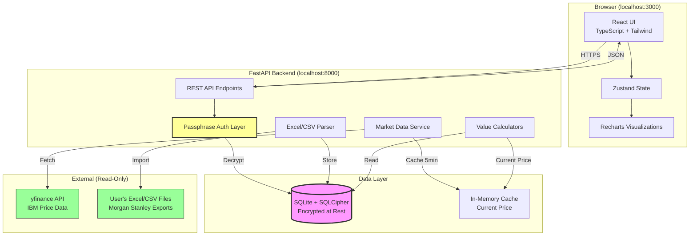

# IBM Equity Dashboard — Architecture & Tech Stack

## 🏗️ Recommended Stack

**Frontend:**
- **React 18** + **TypeScript** - Industry standard, excellent typing, large ecosystem
- **Vite** - Lightning-fast dev server, optimized builds (better than CRA)
- **Tailwind CSS** - Utility-first, rapid UI development, small bundle size
- **Recharts** - React-native charting, declarative API, good for financial data
- **React Router** - Client-side routing for multi-page feel
- **Zustand** - Lightweight state management (simpler than Redux)

**Backend:**
- **FastAPI** (Python 3.11+) - Fast, async, automatic OpenAPI docs, excellent typing
- **SQLite** with **SQLCipher** - Encrypted database at rest, zero-config, file-based
- **Pydantic** - Data validation, matches TypeScript types well
- **uvicorn** - ASGI server for FastAPI

**Data & Integration:**
- **yfinance** - No API key needed, reliable IBM price data, Python-native
- **openpyxl** - Excel file parsing (handles your .xlsx spoof data)
- **pandas** - Data manipulation for imports and calculations

**Security:**
- **cryptography** (Python) - AES-128-GCM encryption for sensitive data
- **argon2-cffi** - Password hashing for passphrase
- **python-dotenv** - Environment variable management

**Why NOT Tauri/Electron for MVP:**
- Localhost web app is simpler to develop and debug
- No code signing or distribution complexity
- Easy to upgrade to Tauri later if desired
- Browser security model is well-understood

---

## 📊 Architecture Diagram



---

## 🔐 Data Flow & Trust Boundaries

### **Trust Boundary 1: User's Machine**
- **Inside:** All application code, database, encryption keys
- **Threat:** Physical access, malware, keyloggers
- **Mitigation:** Encryption at rest, passphrase required, no plaintext logs

### **Trust Boundary 2: Network**
- **Outside:** yfinance API (read-only, public data)
- **Threat:** MITM, DNS poisoning
- **Mitigation:** HTTPS only, certificate pinning (future), price data is public anyway

### **Trust Boundary 3: File System**
- **Inside:** SQLite database, import files
- **Threat:** Unauthorized file access
- **Mitigation:** SQLCipher encryption, file permissions (600), secure delete on import

---

## 🔄 Component Interactions

### **Startup Flow:**
1. User opens `http://localhost:3000`
2. Frontend checks if backend is running (health check)
3. If database exists → prompt for passphrase
4. If new install → prompt to create passphrase
5. Backend decrypts database with passphrase-derived key
6. Frontend loads dashboard data via API

### **Import Flow:**
1. User uploads Excel file via UI
2. Frontend sends file to `/api/import/excel`
3. Backend parses with openpyxl
4. Validates schema against expected Morgan Stanley format
5. Stores in encrypted SQLite
6. Returns import summary (X RSUs, Y options, Z ESPP shares)

### **Price Update Flow:**
1. Background task runs every 5 minutes (configurable)
2. Fetches IBM price from yfinance
3. Caches in memory (no DB write for ephemeral data)
4. Frontend polls `/api/market/current` every 30 seconds
5. UI updates all calculated values reactively

### **What-If Modeling:**
1. User types price in "What-If" input
2. Frontend calculates all values client-side (no API call)
3. Displays updated totals, intrinsic values, ESPP gains
4. Does NOT persist the hypothetical price

---

## 📁 Project Structure

```
ibm-equity-dashboard/
├── backend/
│   ├── app/
│   │   ├── __init__.py
│   │   ├── main.py              # FastAPI app entry point
│   │   ├── config.py            # Settings, env vars
│   │   ├── database.py          # SQLCipher connection
│   │   ├── auth.py              # Passphrase verification
│   │   ├── models.py            # Pydantic schemas
│   │   ├── crud.py              # Database operations
│   │   ├── routers/
│   │   │   ├── __init__.py
│   │   │   ├── import_router.py    # Excel/CSV import
│   │   │   ├── holdings.py         # RSU/Options/ESPP endpoints
│   │   │   ├── market.py           # Price data
│   │   │   ├── analytics.py        # Calculations, what-if
│   │   ├── services/
│   │   │   ├── __init__.py
│   │   │   ├── parser.py           # Excel parsing logic
│   │   │   ├── calculator.py       # Intrinsic value, tax estimates
│   │   │   ├── market_data.py      # yfinance integration
│   │   │   ├── encryption.py       # AES-128 wrapper
│   │   ├── schemas/
│   │   │   ├── __init__.py
│   │   │   ├── rsu.py
│   │   │   ├── option.py
│   │   │   ├── espp.py
│   │   │   ├── vesting.py
│   ├── tests/
│   │   ├── test_parser.py
│   │   ├── test_calculator.py
│   │   ├── test_api.py
│   ├── requirements.txt
│   ├── .env.example
│   └── README.md
│
├── frontend/
│   ├── src/
│   │   ├── main.tsx             # React entry point
│   │   ├── App.tsx              # Root component
│   │   ├── components/
│   │   │   ├── Dashboard.tsx        # Main dashboard view
│   │   │   ├── SummaryTiles.tsx     # Value cards
│   │   │   ├── HoldingsTable.tsx    # RSU/Options/ESPP tables
│   │   │   ├── VestingTimeline.tsx  # Upcoming vests
│   │   │   ├── WhatIfModeler.tsx    # Price scenario tool
│   │   │   ├── ValueChart.tsx       # Recharts wrapper
│   │   │   ├── ImportWizard.tsx     # File upload UI
│   │   │   ├── Disclaimer.tsx       # Legal notice
│   │   │   ├── UnlockScreen.tsx     # Passphrase entry
│   │   ├── store/
│   │   │   ├── useAppStore.ts       # Zustand store
│   │   ├── services/
│   │   │   ├── api.ts               # Axios wrapper
│   │   ├── types/
│   │   │   ├── holdings.ts
│   │   │   ├── market.ts
│   │   ├── utils/
│   │   │   ├── formatters.ts        # Currency, date formatting
│   │   │   ├── calculations.ts      # Client-side math
│   │   ├── styles/
│   │   │   ├── globals.css
│   ├── public/
│   ├── index.html
│   ├── package.json
│   ├── tsconfig.json
│   ├── vite.config.ts
│   ├── tailwind.config.js
│   └── README.md
│
├── docs/
│   ├── ARCHITECTURE.md          # This document
│   ├── THREAT_MODEL.md          # Security analysis
│   ├── FORMULAS.md              # All calculation formulas
│   ├── COMPLIANCE.md            # Legal disclaimers
│   └── BACKUP.md                # Backup/restore guide
│
├── sample-data/
│   ├── rsu_sample.csv
│   ├── options_sample.csv
│   ├── espp_sample.csv
│   └── README.md
│
├── .gitignore
├── docker-compose.yml           # Optional: containerized setup
└── README.md                    # Main setup guide
```

---

## 🎯 Key Design Decisions

### **1. Why FastAPI over Node.js?**
- **yfinance** is Python-native (no good Node equivalent)
- **pandas** makes Excel parsing and data manipulation trivial
- **SQLCipher** has excellent Python bindings
- FastAPI's automatic OpenAPI docs help with debugging
- Python's scientific computing ecosystem (numpy) useful for financial calculations

### **2. Why SQLite over PostgreSQL?**
- **Zero configuration** - no server to manage
- **File-based** - easy backup (just copy the .db file)
- **SQLCipher** provides transparent encryption
- **Sufficient performance** for single-user, <10k records
- **Portable** - works on any OS without installation

### **3. Why Vite over Create React App?**
- **10x faster** dev server startup
- **Smaller bundles** with better tree-shaking
- **Native ESM** support
- **Better TypeScript** integration
- CRA is deprecated by React team

### **4. Why Zustand over Redux?**
- **Simpler API** - less boilerplate
- **Smaller bundle** (~1KB vs ~10KB)
- **No context providers** needed
- **TypeScript-first** design
- Sufficient for this app's state complexity

### **5. Why yfinance over paid APIs?**
- **No API key** required
- **No rate limits** for reasonable use
- **Reliable** for NYSE stocks like IBM
- **Free forever** (scrapes Yahoo Finance)
- **Fallback**: Can add Alpha Vantage later if needed

---

## 🔒 Security Considerations

### **Encryption Strategy:**
- **Database:** AES-128-GCM via SQLCipher (balanced security/performance)
- **Key Derivation:** Argon2id from user passphrase (memory-hard, GPU-resistant)
- **Salt:** Unique per database, stored in plaintext header
- **No key storage:** Passphrase required on every app start

### **What's Encrypted:**
- All equity holdings (RSUs, options, ESPP)
- Vesting schedules
- Historical import data
- User preferences

### **What's NOT Encrypted:**
- IBM stock price (public data)
- Application logs (contain no PII)
- Frontend code (standard web app)

### **Attack Scenarios:**
| Threat | Mitigation |
|--------|-----------|
| Stolen laptop | Database encrypted, passphrase required |
| Malware/keylogger | Out of scope (OS-level threat) |
| Shoulder surfing | Auto-lock after 15min idle (future) |
| Network sniffing | Localhost-only, no external traffic except yfinance (HTTPS) |
| SQL injection | Parameterized queries, Pydantic validation |
| XSS | React's built-in escaping, CSP headers |

---

## 📈 Performance Targets

- **Startup:** < 2 seconds (cold start with passphrase)
- **Import:** < 5 seconds for 1000-row Excel file
- **Dashboard load:** < 500ms (all data, all calculations)
- **Price refresh:** < 1 second (yfinance API call)
- **What-if recalc:** < 100ms (client-side, no API)

---

## 🚀 Deployment Model

**Development:**
```bash
# Terminal 1: Backend
cd backend
python -m venv venv
source venv/bin/activate
pip install -r requirements.txt
uvicorn app.main:app --reload --port 8000

# Terminal 2: Frontend
cd frontend
npm install
npm run dev  # Runs on localhost:3000
```

**Production (local use):**
```bash
# Build frontend
cd frontend && npm run build

# Serve via FastAPI static files
cd backend
uvicorn app.main:app --host 127.0.0.1 --port 8000
# Frontend served at http://localhost:8000
```

**Future: Desktop App (Tauri)**
- Single executable, no terminal needed
- System tray icon
- Auto-start backend
- Native file picker for imports

---

## ✅ Review Checklist

Please review this architecture and confirm:
1. Does the tech stack make sense for your use case?
2. Any concerns about the localhost web app vs. desktop app?
3. Should I proceed with the **Threat Model** document next?
4. Any questions about the data flow or component interactions?

Once approved, I'll move on to the detailed threat model and then the milestone-based implementation plan.